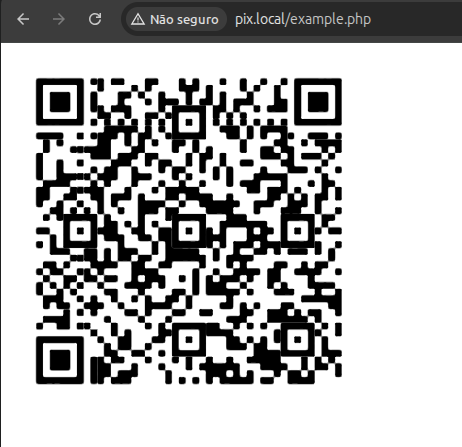

## Gera Qrcode PIX via PHP

Sem dependências gerais para qualquer pacote a mais.

-Requisitos PHP 8.4

-Depende da lib chillerlan/php-qrcode é usado unicamente para converter o texto para QrCode.

## Exemplo de geração do QrCode .


Código usado para geração de QrCode PIX - no padrão Febrapan
```
$chave = 'xxxx'; // chave aleatória
$nome = 'THYAGO HENRIQUE PACHER';
$cidade = 'PONTA GROSSA';
$valor = 1.65;
$width = 360;
$height = 360;
echo (new PixQrcode)->chavePix($chave)
    ->nomeRecebedor($nome)
    ->cidade($cidade)
    ->valor($valor)
    ->gerar($width, $height);

```